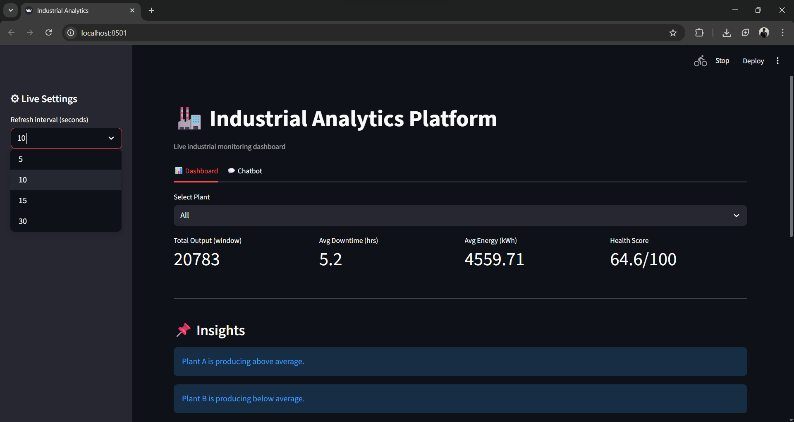
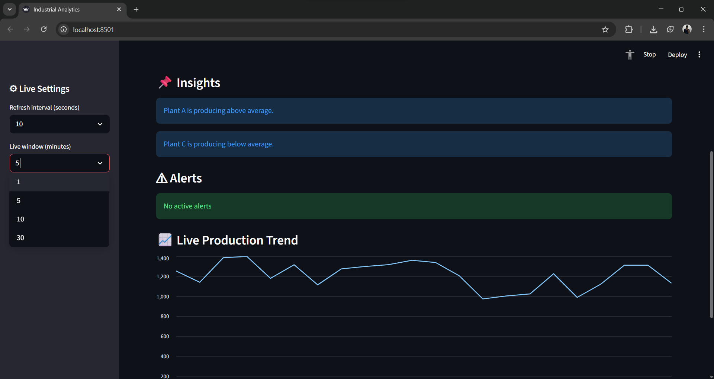
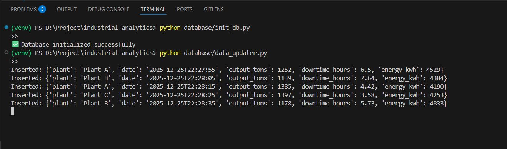
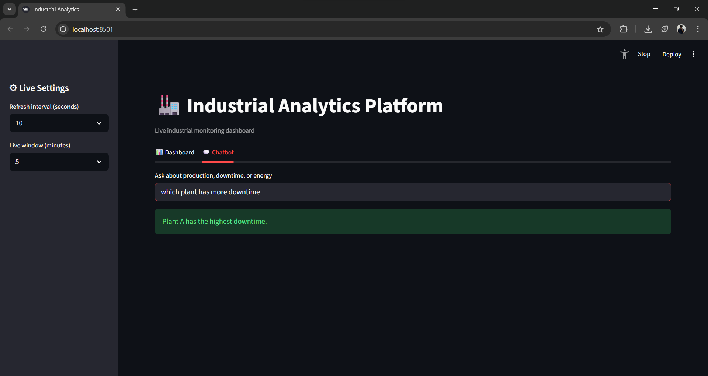

# 🏭 Industrial Analytics Dashboard

A real-time industrial analytics platform that simulates continuous production data ingestion and provides live KPIs, trends, alerts, and insights through an interactive dashboard.

This project is designed to reflect how modern manufacturing plants monitor operational performance in near real-time.

---

## 📌 Problem Statement

Manufacturing industries generate large volumes of operational data such as production output, machine downtime, and energy consumption.  
Monitoring this data in real-time is critical for:

- Operational efficiency
- Downtime reduction
- Energy optimization
- Quick decision-making

This project simulates such an industrial monitoring system using a database-driven analytics pipeline.

---

## 🎯 Project Objectives

- Simulate real-time industrial data ingestion
- Store and manage production data using a database
- Display live KPIs and trends without data duplication
- Generate insights and alerts automatically
- Provide an interactive and stable dashboard experience

---

## 🚀 Key Features

- 🔄 **Live Data Ingestion**  
  Simulates continuous industrial data flow using an automated updater.

- 🗄 **Database-Driven Architecture**  
  Uses SQLite to mimic real production data storage instead of static CSV files.

- ⏱ **Sliding Time-Window Analytics**  
  Displays only recent data to prevent duplication and inflated metrics.

- 📊 **Real-Time Dashboard**  
  Live KPIs, charts, trends, and alerts using Streamlit.

- ⚠ **Automated Alerts**  
  Highlights abnormal conditions such as high downtime or energy usage.

- 💬 **Interactive Chatbot**  
  Allows users to ask natural language questions about the data.

- 🪟 **Windows-Stable Execution**  
  Handles Streamlit file-watcher issues for reliable execution on Windows.

---

## 🧠 System Architecture (High Level)

```
Data Generator (Simulated)
          ↓
  SQLite Database
          ↓
Data Loader (Pandas)
          ↓
Analytics Layer (KPIs, Alerts, Insights)
          ↓
  Streamlit Dashboard
```

---

## 🛠 Tech Stack

| Component        | Technology |
|------------------|------------|
| Programming      | Python |
| Dashboard        | Streamlit |
| Data Processing  | Pandas, NumPy |
| Database         | SQLite |
| Version Control  | Git, GitHub |

---

## 📂 Project Structure

```
industrial-analytics/
│
├── analytics/
│   ├── kpis.py
│   ├── alerts.py
│   ├── insights.py
│   └── charts.py
│
├── chatbot/
│   └── qa_engine.py
│
├── database/
│   ├── db.py
│   ├── init_db.py
│   └── data_updater.py
│
├── ingestion/
│   └── data_loader.py
│
├── data/
│   └── production_data.csv
│
├── app.py
├── requirements.txt
├── README.md
└── .gitignore
```

---

## ▶️ How to Run the Project

### 1️⃣ Create Virtual Environment
```bash
python -m venv venv
venv\Scripts\activate
```

### 2️⃣ Install Dependencies
```bash
pip install -r requirements.txt
```

### 3️⃣ Initialize Database
```bash
python database/init_db.py
```

### 4️⃣ Start Live Data Generator
```bash
python database/data_updater.py
```

### 5️⃣ Run the Dashboard
```bash
streamlit run app.py --server.fileWatcherType none
```

---
## 📸 Project Preview






---

## 📊 KPIs Tracked

- Total Production Output
- Average Downtime
- Average Energy Consumption
- Overall Plant Health Score

---

## ⚠ Alert Logic (Examples)

- Downtime exceeds acceptable threshold
- Energy consumption spikes
- Production output drops below normal range

Alerts update dynamically as new data arrives.

---

## 💬 Chatbot Capabilities

The chatbot supports questions like:

- "What is the total production?"
- "Which plant has highest downtime?"
- "How is energy consumption today?"

---

## 🧪 Design Decisions & Challenges Solved

- Avoided CSV-based analytics to simulate real industry pipelines
- Handled mixed datetime formats safely using Pandas
- Prevented data duplication using sliding time-window analytics
- Resolved Streamlit auto-refresh and Windows file watcher issues
- Separated ingestion, analytics, and visualization layers

---

## 🔮 Future Enhancements

- Predictive maintenance using machine learning
- Cloud database integration (PostgreSQL / BigQuery)
- Role-based dashboards
- Alert notifications via email or SMS
- Deployment on cloud platforms

---

## 👤 Author

**Anuj Mhatre**  
IT Student | TCET

---

## 📜 License

This project is for academic and learning purposes.
