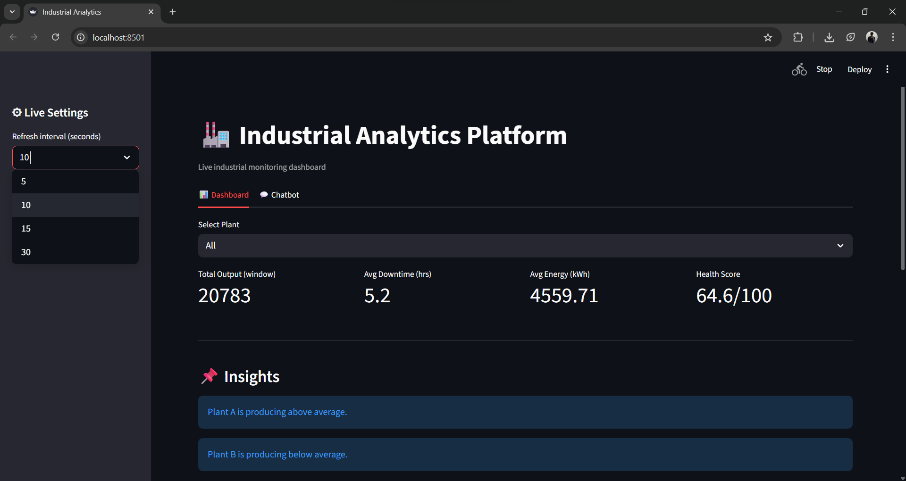
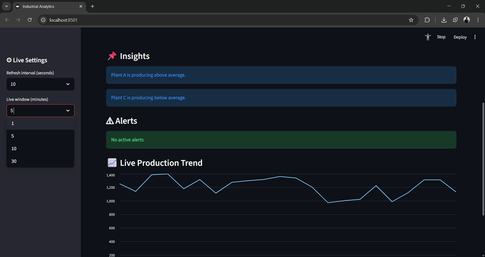
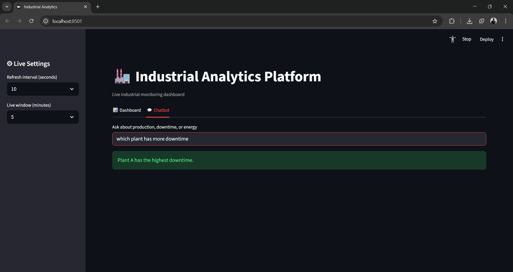

# Industrial Analytics Dashboard

> Real-time industrial analytics system with live data ingestion, KPI tracking, and anomaly detection.

A production-ready Streamlit dashboard for real-time monitoring of industrial operations with live KPIs, automated anomaly detection, and a rule-based conversational analytics chatbot.

---

## Overview

Industrial facilities generate vast amounts of operational data that require continuous monitoring to identify inefficiencies and prevent downtime. This dashboard provides a unified platform for real-time visibility into production metrics, automated anomaly detection, and interactive query capabilities—enabling operations teams to make data-driven decisions without manual data analysis.

---

## Key Features

* **Real-Time KPIs**: Tracks production output, downtime, energy consumption, efficiency, and system health with live updates
* **Automated Anomaly Detection**: Detects downtime spikes, energy anomalies, statistical outliers, and efficiency drops
* **Conversational Analytics**: Query system metrics using a rule-based chatbot
* **Sliding Time-Window Architecture**: Ensures accurate analytics without data duplication
* **Single-Command Execution**: Full system runs with `streamlit run app.py`

---

## Tech Stack

| Layer               | Technology |
| ------------------- | ---------- |
| Frontend            | Streamlit  |
| Backend             | Python     |
| Data Processing     | Pandas     |
| Database            | SQLite     |
| Real-Time Ingestion | Threading  |

---

## 📸 Screenshots

### Dashboard



### Analytics & Alerts



### Chatbot



---

## How It Works

The system follows a three-layer architecture:

1. **Data Ingestion Layer**
   Continuously updates production data into SQLite using a background thread

2. **Analytics Layer**
   Computes KPIs, detects anomalies, and generates insights using time-windowed analysis

3. **Presentation Layer**
   Displays real-time metrics and provides a chatbot interface for querying data

```
Streamlit App
   ↓
Analytics Engine (KPIs, Alerts, Insights)
   ↓
Background Updater Thread
   ↓
SQLite Database
```

---

## KPI Definitions

* **Total Production Output**: Windowed sum of production (tons)
* **Average Downtime**: Mean equipment downtime
* **Average Energy Consumption**: Mean energy usage (kWh)
* **Efficiency Score**: Output relative to energy and downtime
* **Health Score**: Weighted composite performance metric
* **Production Trend**: Moving average with direction indicator

---

## Alert Conditions

| Alert Type          | Trigger Condition      |
| ------------------- | ---------------------- |
| Downtime Spike      | Avg downtime > 6 hours |
| Energy Anomaly      | Energy > 1.2× median   |
| Statistical Outlier | Output > mean + 2σ     |
| Efficiency Warning  | Efficiency < threshold |

---

## Run Locally

```bash
pip install -r requirements.txt
streamlit run app.py
```

---

## Configuration

**Data Mode (database/data_updater.py):**

```python
MODE = "dataset"      # realistic replay
# MODE = "simulation"  # synthetic data
```

**Dashboard Settings (UI Sidebar):**

* Time window: 1–30 minutes
* Refresh interval: 5–30 seconds

---

## Project Structure

```
industrial-analytics/
├── app.py
├── requirements.txt
├── analytics/
├── database/
├── ingestion/
├── chatbot/
├── config/
├── data/
└── screenshots/
```

---

## Live Demo

https://industrial-analytics-algoonerd.streamlit.app/

---

## Project Significance

This project demonstrates how real-time industrial analytics systems are designed and implemented.

Key engineering aspects:

* Background data ingestion without blocking UI
* Sliding window analytics for consistency
* Composite KPIs for actionable insights
* Conversational interface for accessibility

---

## Future Improvements

* Multi-plant comparative analytics
* Predictive maintenance using ML
* Custom alert thresholds
* Report export (PDF/Excel)
* Role-based access control
* Scalable database (PostgreSQL)
